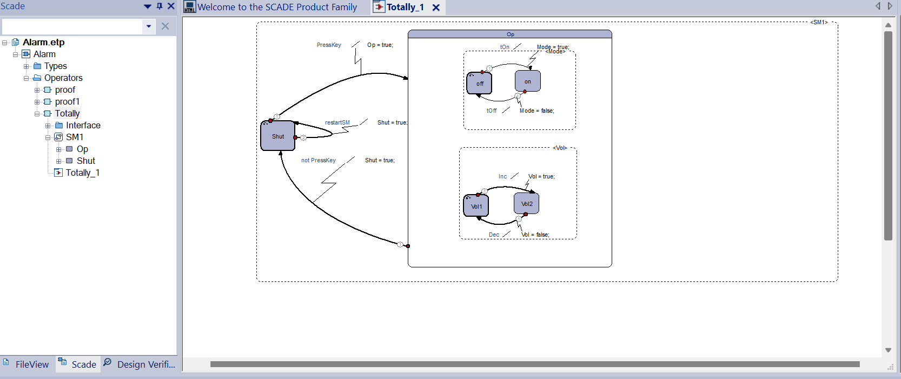
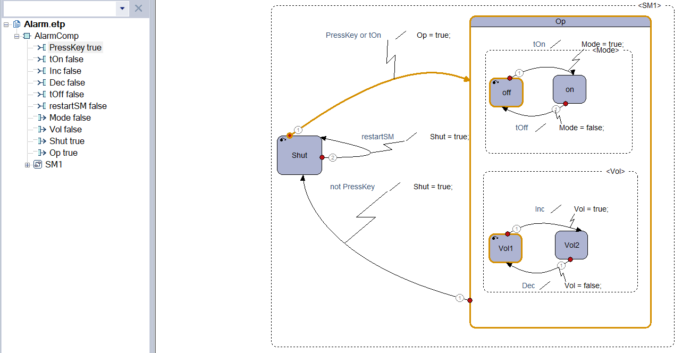
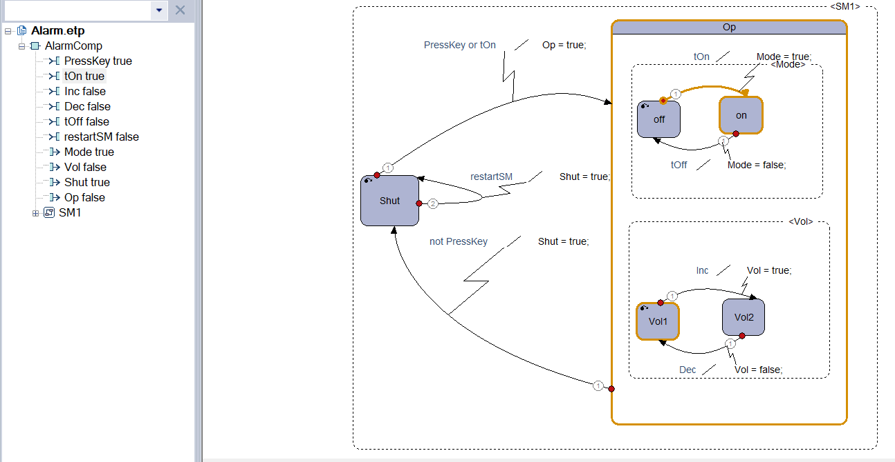
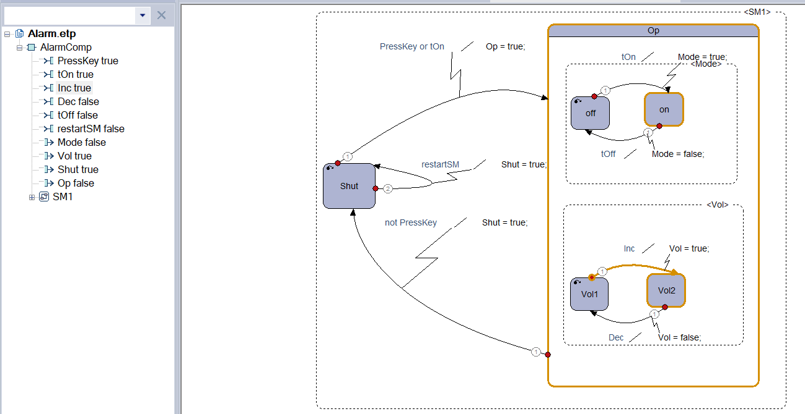
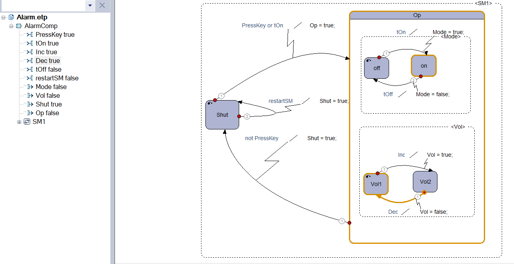

# Implementation of Alarm System in SCADE

In this implementation, the Alarm system is situated within the Scade operating environment's AlarmCom operator. The initial state of the system is denoted as `SM1`, and it includes two modes: `Shut` and `OP`.

The behavior of the system is governed by the `PressKey` input, which is a boolean value. When `PressKey` is true, it corresponds to the system's start action, and when false, it corresponds to shutting the system. Transitions in this system rely on strong conditions.

The key adjustment involves correcting the `PressKey` entry to ensure a transition to the `OP` mode. Additionally, there are two parallel state machines: `Vol` and `Mode`. The `Vol` state machine is responsible for managing two volume levels, 1 and 2, while the `Mode` state machine handles two modes: `on` and `off`.

Transition conditions for the modes are established based on inputs `tOn` and `tOff`. When `tOn` is true, the system switches to the "on" mode, and `tOff` leads to the "off" mode. In the `Vol` state machine, `Inc` leads to `2Vol` when true, and `Dec` leads to `1Vol` when true.

It's important to note that changing the mode in one state machine doesn't affect the parallel state machine. Visual aids, such as diagrams and images, help clarify the transitions and states.

  

## Transitions and Visuals

Each transition is associated with a corresponding output, which aids in debugging and analyzing the active state, especially in non-animated modes.

## State Changes

Based on the provided diagram, transitioning from `OP` mode to `Shut` mode is possible by setting `PressKey` to false and otherwise.

  

## Walkthrough

In the `OP` mode, based on the diagram, a transition is made by setting the `PressKey` input (start) to true. This is influenced by the initial mode settings: off for `Mode` and Vol1 for `Vol`. As a result, the `OP` mode becomes active upon entry.

  

In another scenario depicted in picture 3, with `tOn` set to true, the `Mode` state machine switches to "on." Simultaneously, the `Vol` state machine remains in `1Vol` mode, and the main machine mode is `OP`.

  

Image 4 illustrates that by setting `Inc` to true, the `Vol` mode transitions to `2Vol`. Similarly, in picture 5, `Dec` becomes true, following the previous change, leading to a transition to `1Vol`.

  

## Conclusion

Finally, changing `PressKey` to false causes the main machine (`SM1`) to transition from `OP` mode to `Shut` mode, concluding the scenario smoothly.
